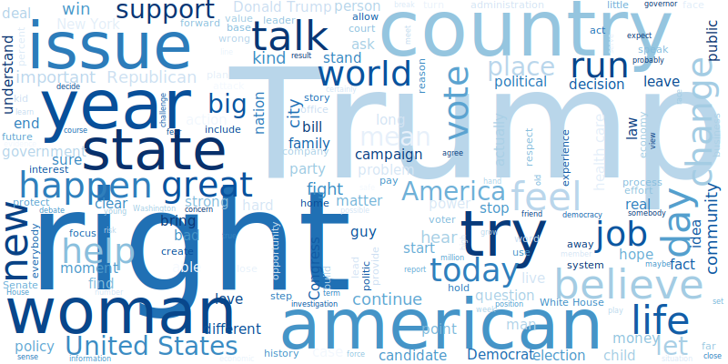
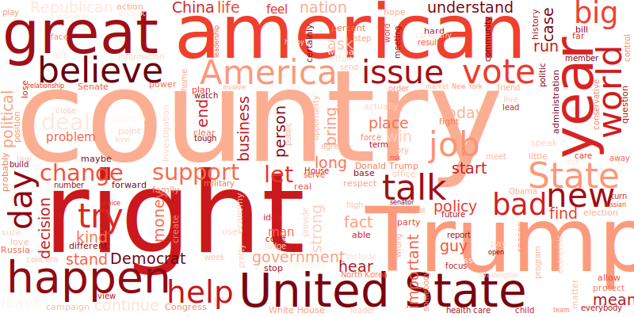

## Introduction

### Abstract

Everyday, millions of articles are published in the newspapers. All Americans have a favorite newspaper, whether it is the New York Times, the CNN, the Fox News or any other journal that everyday publishes the latest breaking news. News coverage can be very influential, affecting one’s opinion through the information it provides or the emotional reaction it generates on the reader. Most of these newspapers claim having a neutral political opinion, but in general, a newspaper’s phrasing or language is specifically chosen with the intention of exposing a certain political outcome. Thus, the reader’s opinion is easily influenced by the content published in its favorite journal, although he’s not conscious of it. For example, CNN is known to emphasize the democratic opinion while the Fox News is known for its republican ideas.
Analyzing the content of a newspaper is therefore a good way to verify its political orientation and the political ideas it wants to transmit. This data story presents a quotation based analysis of newspapers and their political bias.

### Method
The ultimate goal of this analysis is to define the political orientation the newspapers. Indeed, is it possible to guess the opinion of a newspaper based only on its content? Popular newspapers should be neutral in the way they present the news, is it really the case? Otherwise, which political party do they support the most?
This is adressed through several questions:
<ul class="default">
    <li>Who are the main speakers quoted in the newspapers and from what political party are they?</li>
    <li>What is the opinion of newspapers on big subjects and debated topics? Are these opinions drifting towards one political party?</li>
    <li>Are there any specific topics that are frequently addressed by newspapers? Are those topics relevant to define the newspapers' political opinion?</li>
</ul>

In the following, the Quotebank dataset regrouping quotations published in multiple english newspapers between 2015 and 2020 is analysed. We focused our attention on 3 newspapers: the New York Times, the CNN and the Fox News. The determination of the political orientation of the journals is based on topics that are commonly addressed in the USA and on which Republicans and Democrats tend to argue a lot. 
We use dictionaries related to the topics to select the interesting quotations and sentiment analysis as indicator of one's opinion. Statistical tests as well as dimensionality reduction techniques will help us interpret our data. 
Additionally, we look at the way the current topics are presented in the newspapers to help us assess their political preference. 

Throughout the whole analysis, we compare the the results from the 3 different newspapers, keeping in mind their respective political bias assumptions. 

### Newspapers



## First analyses
A first overview of our dataset allowed us to extract some interesting information.

### Who are the main speakers?

Newspapers publish millions of quotations coming from millions of different personalities. However, some speakers may be published more than others. We call them recurrent speakers. In addition, the recurrent speakers can also be specific to each newspaper. Thus, the speaking time of a personality in a newspaper could be a hint to show how much the journal agrees with their ideas and would want to emphasize them! In other words, is the importance that a newspaper gives to a person by publishing his words already a clue as to the opinion of the newspaper? 

<!-- Figure: Barplot for each newspaper -->






All newspapers agree on at leat one point: from 2015 to 2020 all years combined, Donald Trump is by far **the** speaker in the news. We shouldn't be surprised by this result, as he has been the President of the Unite States most of these years. 

Additionally, we see that six names are present in the three top 10 speakers: Donald Trump, Barack Obama, Hillary Clinton, Joe Biden, Nancy Pelosi and Bernie Sanders. These public figures have played a major role in the 2015-2020 period, but do not indicate any potential politic bias, as they are present in all newspapers. Let’s have a look at the remaining speakers. For the NYT, only Democratic politicians (Bill de Blasio, Elizabeth Warren, Chuck Schumer) or self-described Democratic public figures (Stephen Colbert) are in the top 10. On the other hand, FOX News only features Republican politicians (Lindsey Graham, Charles Krauthammer, Mitch McConnell). There is also Tucker Carlson, who has hosted 'Tucker Carlson Tonight' on Fox News since 2016, and describes himself as a Republican perosnality. For CNN we have more contrasting results, Elizabeth Warren for the Democratic party and Lindsay Graham, Mike Pompeo and Mitch McConnell for the Republican party. These results already give us a clue about the global political opinion of the NYT, which mainly gives the floor to Democrats and of FOX News, which mainly gives the floor to Republicans.

But let's remember that a newspaper that publishes the words of a certain person does not necessarily agree with him/her. 
In fact, it is possible that the newspaper uses the words of this person against him or her, to criticize him/her. The example of Trump illustrates this case perfectly: Trump seems to be strongly present in the CNN. However, it would be very surprising if the CNN actually approved of all his words.
Considering this and considering the clear domination of Donald Trump in the news, one can not simply conclude one newspaper's ideas simply based on the importance it gives to each personality. Nervertheless, it can provide some interesting clues...

### What about the party distribution in the newspapers?
We focus now not on the *speakers* themselves, but mostly on their *party*. Knowing the party of each speaker (*Republican*, *Democrat, another party* or *no identified party*), we can group together all the speakers that belong to the same party and assess the importance attributed to each of them in the newspapers. Can we already perceive a news coverage bias towards one of the parties?







Comparing the results from all three newspapers, we observe interesting things. First of all, it is obvious that the Republican party is party that is the most represented in all three journals. Again this is not surprising given that Donald Trump has been in charge of the United-States during most of the selected period. One can also note that the NYT has the largest percentage of *No Party* (around 62% against 40% and 45%). A possible explanation for that is that the paper talks less about politics, or if it does, it gives more importance to people who are not affiliated to any party that the other journals.

Going deeper in our analysis, it might be worth looking at the ratio of Republicans against Democrats speaking time (% Democrat / % Republican). For CNN and Fox, this ratio is equal to 0.64 and 0.65 respectively, which means that in both newspapers, the Democratic party is less represented than the Republican one by about 35%. For the NYT we get a ratio of 0.80, meaning that the Democrats are less represented than the Republicans by only 20%. Thus, comparing all three newspapers, the New York Times tends to give more importance to the Democrats than the other two newspapers. This could be again a first sign of political bias from the NYT towards the Democratic party.

Finally, the *Other Parties* are only marginally represented in these newspapers, showing the dominance of the two major parties: Democrat and Republican. 

### The most frequent words
During the entire analysis, we tried to oppose two major parties: the Republican one and the Democratic one. We assumed that the parties distinguish themselves through the words that are used, the subjects that are adressed and how they're addressed. Therefore, we are first interested in seeing which words are the most used for each party. Are they different? Are some words significant for the party? 

<!-- Figure: Wordcloud for each newspaper -->
**Wordcloud for the Democratic party**
 

 

**Wordcloud for the Republican party**
 

 
The comparison of these two worldclouds highlights the similarities as well as differences between the two parties. Indeed, even if they are drastically opposed on many topics, there are some similarities in the words that are used: *Trump* is an exmaple. For the Democratic Party, the terms 'issue' 'right' 'woman' 'try' and 'support' are interesting because they reflect, in a very simplified way, the Democratic ideologies. On the Republican side, the terms 'America' and 'great' appear, consistent with the slogan 'Make America Great Again'. There is also a strong use of 'country' 'United State' 'State' and 'nation' in line with the nationalist-ish viewpoint of the Republicans. Finally, these plots allow us to ensure that the selected quotations are representative of the divergent opinions between Republicans and Democrats, and that it is therefore interesting to study them more precisely using a sentimental analysis.

## Sentiment analysis: party-specific opinions?
The Wordclouds may have been useful to visualise what the different political parties talk the most about, but what if we want to compare their opinions on the same subjects? Let's go deeper in our thoughts now, by applying a **Sentiment Analysis** on different chosen topics.

### Topics in the newspapers
Our idea was to use Sentiment Analysis to quantify the opinion of each party on specific topics. For both Democrat and Republican speakers, we collected the quotes talking about  the different topics that are given in the table below. Next to each topic are shown some example words that we used to generate a complete dictionnary.



The 11 topics were specifically chosen because they are current topics that are often present in the news. Since these topics tend to create a lot of debates in the United States within the different parties, and since we believe that each party has a well-defined opinion on each of these subjects, we believe that it would be possible to determine one's political opinion based on his/her opinion about each topic.

#### Can we use sentiment analysis to compare the political parties?
For each of these topics, we computed the mean opinion score of each party. The scores range from **-1** (for a **negative** opinion) to **+1** (for a **positive** opinion).  
We then proceeded to do the same analysis separately with our 3 newspaper's quotes, to obtain mean opinion scores for all three of them. We took the example of the New York Times newspaper.

<!-- Figure: Barplot average of compound score for each topic, each party -->

    
Clearly, the Sentiment Analysis results are not the expected ones. Following these results, we would conclude that both parties tend to agree on most of the topics: they're against war and violence and have very positive emotions towards Donald Trump for example. Some results may possible, but we should at least observe a clear demarcation in the opinion scores on topics such as tax or health care, on which both parties are drastically opposed. On the contrary, in our results, there is little to no significant difference between Democrats and Republicans. Furthemore, as most of the mean sentiment scores are very close to 0, does that mean that the newspapers have in general a neutral opinion on each of the topics? And do Republicans really have a neutral opinion on immigration? Waht about neutral emotions towards racism? It seems absurd to make such conclusions. Therefore, we conclude that **our sentiment analysis was unsuccessful**, and we can't use it to determine any news coverage bias.

*Why is it the case?* 
We used a simple pretrained model for our sentiment analysis, based on emotions. In addition, the Sentiment Analysis shouldn't be considered optimal for the difficult task of computing the opinions towards a topic. In fact, the way our Sentiment Analysis was built is by only considering the positive and negative words in the quotations, without taking into account the context of the words. Therefore, two quotations that have an opposite meaning on the same topic can have the same sentiment score, just because both quotations use positive key words or on the contrary negative ones.
To sum up, the emotions that are perceived in one's quote are not direclty representative of the speaker's opinion wthout the context.

<!-- complete if not enough-->

### Political orientation of speakers and newspapers

Another way of assessing the pertinence of the sentiment scores to indicate the ideology of the speakers is by projecting the speaker-specific scores into a substantively meaningful vector space, that has a maximum variance. Using standard dimensionality reduction techniques such as principal component analysis (PCA), we can then visualise the repartition of speakers according to their sentiment scores.
In this section, we focused on the identified authors of the quotes that belong to one of the two selected parties. We tried to emphasize the demarcation of the parties using the speaker-specific sentiment scores. Are the sentiment scores attributed to each speaker meaningful enough to describe their political orientation? In other words, can we use the sentiment scores to distinguish speakers from opposing parties?
Each datapoint in the plots corresponds to a speaker and is characterized by the sentiment scores averaged over all of their quotations.

The New York Time's results are taken as example. Note that for visualisation purposes, only two components are selected.



The results are coherent with our inital conclusions: **the sentiment scores alone are not sufficient to describe one's political opinion**.
Indeed, we would have hoped to see two distinct groups of people in the plots: the republicans on one side and the democrats on the other. This would have been the ideal scenario, which would have shown that we can indeed separate the authors from different parties by assessing the sentiments in their words. But clearly, it is not the case: Republicans and Democrats are indistinguishable.
Let's zoom in the center of the plots, to assess the personality that has a value close to 0 for both components. This speaker is well known: it is the current President of the United-States. In fact, when looking at the data, the topic-specific sentiment scores that describe Donald Trump are very close to zero.
How is that possible?
Donald Trump is known for his drastic thoughts, having either very positive or very negative opinions on each topic, but very rarely neutral ones. However, by averaging the sentiment scores over each of his quotations, they cancel each other and we get an average score approaching zero, meaning a neutral point of view. This conclusion isn't accurate and show that to assess the global opinion of a personality, one can't simply average the sentiment scores over all of their quotes. 
Thus, with our method, trying to determine the political bias of the newspapers by analyzing what people say isn't optimal. 

---
## Topic analysis: what are the main topics in newspapers?

Instead of trying to determine what every actor *thinks* of a topic, we could simply quantify how much they *talk* about it. Indeed, the coverage of an event or a debated subject can also give us information about a newspaper's political opinion. The more a journal talks about a subjet, the more it cares about it. 

We thus proceeded to analyze the coverage of different topics over the years, in each of the three newspapers. Below is the quotes distribution per month from 2015 to 2020 for the New York Times, CNN and Fox. The topic of the quote can be selected using the dropdown menu on the left.

**The New York Times**


**CNN**


**FOX**


Clearly the topics are all covered regularly. What is interesting is that we can identify major events simply by looking at the peaks in quotes repartition: for example, the number of quotes about racism in the NYT exploded in August 2017, right at the time of the white nationalist walk in Charlottesville. This peak is even more remarkable in the CNN quotes count, and way less present for Fox. This shows a clear gap in interest in this event between the different newspapers. On one hand we find the NYT and CNN, which by mentioning the subject many times, seem to have a great interest in this event. On the other hand we have Fox News, which expresses itself little on the event and thus shows a lack of interest in it. However, if we look at the political level, the the white nationalist walk in Charlottesville is a series of rallies of the American far right. Thus, by a broad generalisation, we attribute this event to the Republican Party (right). It would therefore be logical for Republican newspapers to mention but not to polemicise on this subject and for Democratic newspapers to express themselves more on this event in opposition to their ideologues. By this reasoning, we would have the NYT and CNN more Democrat and Fox more Republican. This proves that looking at the quotes repartition can help us analyze a newspaper’s political orientation.

More than the general quotes about a topic, what gives us further information on a journal’s political side is the speaking time allocated to each party. Comparing the distribution of republican versus democrat quotes over the years could help determine if the newspaper favors a political party over the other. A neutral journal would equally represent speakers from both parties, on each debated topic. 
To illustrate this idea, we can take a look at the repartition of the Republican's and Democrat's quotes about racism, for each of our three journals.

**The New York Times**
 


**CNN**
 


**FOX**
 


## Conclusion

**TODO**

---

## References


