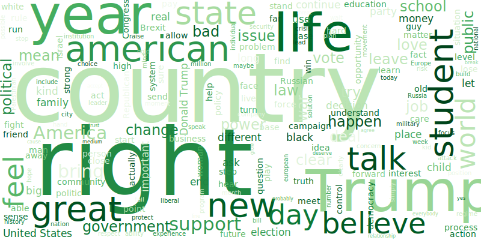
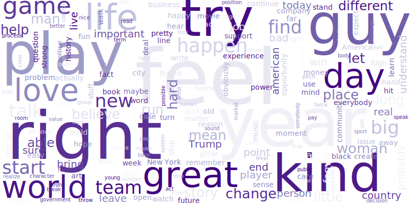

## Introduction

### Abstract

Everyday, millions of articles are published in the newspapers. All Americans have a favorite newspaper, whether it is the New York Times, the CNN, the Fox News or any other journal that everyday publishes the latest breaking news. News coverage can be very influential, affecting one’s opinion through the information it provides or the emotional reaction it generates on the reader. Most of these newspapers claim having a neutral political opinion, but in general, a newspaper’s phrasing or language is specifically chosen with the intention of exposing a certain political outcome. Thus, the reader’s opinion is easily influenced by the content published in its favorite journal, although he’s not conscious of it. For example, CNN is known to emphasize the democratic opinion while the Fox News is known for its republican ideas.
Analyzing the content of a newspaper is therefore a good way to verify its political orientation and the political ideas it wants to transmit. This data story presents a quotation based analysis of newspapers and their political bias.

### Method
The ultimate goal of this analysis is to define the political orientation the newspapers. Indeed, is it possible to guess the opinion of a newspaper based only on its content? Popular newspapers should be neutral in the way they present the news, is it really the case? Otherwise, which political party do they support the most?
This is adressed through several questions:
<ul class="default">
    <li>Who are the main speakers quoted in the newspapers and from what political party are they?</li>
    <li>What is the opinion of newspapers on big subjects and debated topics? Are these opinions drifting towards one political party?</li>
    <li>Are there any specific topics that are frequently addressed by newspapers? Are those topics relevant to define the newspapers' political opinion?</li>
</ul>

In the following, the Quotebank dataset regrouping quotations published in multiple english newspapers between 2015 and 2020 is analysed. We focused our attention on 3 newspapers: the New York Times, the CNN and the Fox News. The determination of the political orientation of the journals is based on topics that are commonly addressed in the USA and on which Republicans and Democrats tend to argue a lot. 
We use dictionaries related to the topics to select the interesting quotations and sentiment analysis as indicator of one's opinion. Statistical tests as well as dimensionality reduction techniques will help us interpret our data. 
Additionally, we look at the way the current topics are presented in the newspapers to help us assess their political preference. 

Throughout the whole analysis, we compare the the results from the 3 different newspapers, keeping in mind their respective political bias assumptions. 

### Newspapers



## First analyses
A first overview of our dataset allowed us to extract some interesting information.

### Who are the speakers?

Newspapers publish millions of quotations coming from millions of different personalities. However, some speakers may be published more than others. We call them recurrent speakers. In addition, the recurrent speakers can also be specific to each newspaper. Thus, the speaking time of a peronality in a newspaper could be a hint to show how much the journal agrees with his or her ideas and would want to emphasize them! In other words, is the importance that a newspaper gives to a person by publishing his words already a clue as to the opinion of the newspaper? 

<!-- Figure: Barplot for each newspaper -->






All newspapers agree on at leat one point: from 2015 to 2020 all years combined, Donald Trump is by far **the** speaker in the news. We shouldn't be surprised by this result, as he has been the President of the Unite States most of these years. 

**TODO** <!-- citer pour chaque journal quels sont les peronnalités, quelles infos on en tire?-->

Let's remember that a newspaper that publishes the words of a certain person does not necessarily agree with him/her. 
In fact, it is possible that the newspaper uses the words of this person against him or her, to criticize him/her. The example of Trump illustrates this case perfectly: Trump seems to be strongly present in the CNN. However, it would be very surprising if the CNN actually approved of all his words.
Considering this and considering the clear domination of Donald Trump in the news, one can not simply conclude one newspaper's ideas simply based on the importance it gives to each personality. Nervertheless, it can provide some interesting clues...

### What about the party distribution in the newspapers?
We focus now not on the *speakers* themselves, but mostly on their *party*. Knowing the party of each speaker (republican, democrat, another party or no identified party), we can group together all the speakers that belong to the same party and assess the importance attributed to each of them in the newspapers. Can we already perceive a news coverage bias towards one of the parties?







**TODO** <!-- Exlpain?
- checker proportion no party? est ce que ca veut dire que neutre?
- nyt a bcp de no party: peut etre nyt parle moisn politique.
- FOx font plus parler les autres party
- en général plus de republicains: normal ya trump, et trum parle bcp comme on peut le voir dans le graph du dessus
- proportion republicain et democrate? analyser et comparer!-->

### The most frequent words
During the entire analysis, we tried to oppose two major parties: the Republican one and the Democratic one. We assumed that the parties distinguish themsleves through the words that are used, the subjects that are adressed and how they are addressed. Therefore, we highlighted the differences in the words that were used the most in the two major opposing parties.

<!-- Figure: Wordcloud for each newspaper -->

<!-- 

-->
 
 **TODO** <!-- Analyse des Occurences of words (wordclouds), est ce que on garderait pas seulement les republicains et les democrates? -->

## Sentiment analysis: party-specific opinions?
The Wordclouds may have been useful to visualize what the different political parties talk the most about, but what if we want to compare their opinions on the same subjects? Let's go deeper in our thoughts now, by applying a sentiment analysis on different chosen topics.

### Topics in the newspapers
Our idea was to use sentiment analysis to quantify the opinion of each party on specific topics. For both Democrat and Republican speakers, we collected the quotes talking about several specific topics that are given in the table below. Next to each topic are shown some example words that we used to generate a complete dictionnary.

<!-- List topics, explain method -->  <!-- A QUEL POINT FAUT VRAIMENT EXPLIQUER LES METHODES DANS LA DATASTORY? -->



<!-- 
<ul class="default">
    <li>immigration</li>
    <li>health care</li>
    <li>climate change</li>
    <li>Trump</li>
    <li>abortion</li>
    <li>women’s rights</li>
    <li>racisms</li>
    <li>violence</li>
    <li>war and military action</li>
    <li>taxes</li>
    <li>coal industry</li>
</ul>
--> 

The 11 topics were specially chosen because they are current topics that are often found in the news. Since these topics tend to create debate in the United States within the different parties, and since we believe that each party has a well-defined opinion on each of these subjects, we believe that it would be possible to determine one's political opinion based on his/her opinion on each individual topic.

#### Can we use sentiment analysis to compare the political parties?
For each of these topics, we computed the mean opinion score for each party. The scores range from **-1** (for a **negative** opinion) to **+1** (for a **positive** opinion).  
We then proceeded to do the same analysis separately with our 3 newspaper's quotes, to obtain mean opinion scores for all three of them. We took the exmaple of the New York Times newspaper.

<!-- Figure: Barplot average of compound score for each topic, each party -->

    
Clearly, the sentiment analysis results are not the ones expected. Following our results, we would conclude that both parties tend to agree on most of the topics: they're against war and violence or have very positie emotions towards Donald Trump for example. Some results may possible, but we should at least observe a clear demarcation in the opinion scores on topics such as tax or health care, on which both parties are drastically opposed. On the contrary, in our results, there is little to no significant difference between Democrats and Republicans. Furthemore, as most of the mean sentiment scores are very close to 0, does that mean that the newspapers have a general neutral opinion on each topic? And do Republicans really have a neutral opinion on immigration? Neutral emotions towards racism? It seems absurd to us to make such conclusions, meaning that **our sentiment analysis was unsuccessful**, and we can't use it to determine any news coverage bias.

<!-- Table: topics with significant difference or not (?) -->

*Why is it the case?* 
We used a simple pretrained model for our sentiment analysis, based on emotions. In addition, the sentiment analysis shouldn't be considered optimal for the difficult task of computing the opinions towards a topic. In fact, the way our sentiment analysis was build is by only considering the positive and negative words in the quotations, without taking into account the context of the words. Therefore, two quotations that have an opposite meaning on the same topic can have the same sentiment score, just because both quotations use positive key words or on the contrary negative ones.
To sum up, the emotions that are perceived in one's quote are not direclty representative of the speaker's opinion, but a context would be needed.

<!-- complete if not enough-->

<!-- cette partie on va pas la faire surement!
#### Sentiment analysis: comparison between the different journals

We can still visualize the sentiment analysis scores for the 3 newspaper, even if the results are not optimal.
**TODO** <!-- Sentiment analysis per topic for each newspaper-->

<!-- Figure: Barplot average of compound score for each topic, each newspaper -->
-->

### Political orientation of speakers and newspapers

Another way of assessing the pertinence of the sentiment scores to indicate the ideology of the seakers is by projecting the speaker-specific scores into a substantively meaningful vector space, that has a maximum variance. Using standard dimensionality reduction techniques such as principal component analysis (PCA), we can then visualize the repartition of speakers according to their sentiment scores.
In this section, we focused on the identified athors of the quotes that belong to one of the two selected parties. We tried to emphasize the demarcation of the parties using the speaker-pecific sentiment scores. Are the sentiment scores attributed to each speaker meaningful to describe his/her political orientation? In other words, can we use the sentiment scores to distinguish speakers from opposing parties?
Each datapoint in the plots correspond to a speaker caracterized by the sentiment scores averaged over all of his/her quotations.

Note that only two components are selected, for visualisation purposes and we take the New York Time results as example.



The results are coherent with our inital conclusions: **the sentiment scores alone are not sufficient to describe one's political opinion**.
Indeed, we would have hoped to see two distinct groups of people in the plots: the republicans on one side and the democrats on the other. This would have been the ideal scenario, which would have shown that we can indeed separate the authors from different parties by assessing the sentiments in their words. But clearly, it is not the case: Republicans and Democrats are indistinguishable.
Let's zoom in the center of the plots, to assess the personality that has a value close to 0 for both components. This speaker is well known: it is the current President of the United_States. In fact, when looking at the data, the topic-specific sentiment scores that describe Donald Trump are very close to zero.
How is that possible?
Donald Trump is known for his drastic thoughts, having either very positive or very negative opinions on each topic, but very rarely neutral ones. However, by averaging the sentiment scores over each of his quotations, they cancel each other and we get an average score approaching zero, meaning a neutral point of view. This conclusion isn't accurate and show that to assess the global opinion of a personality, one can't simply average the sentiment scores over all of his/her quotes. 
Thus, with our method, trying to determine the political bias of the newspapers by analyzing what people say isn't optimal. 

---
## Topic analysis: what are the main topics in newspapers?

Instead of trying to determine what every actor *thinks* of a topic, we could simply quantify how much they *talk* about it. Indeed, the coverage of an event or a debated subject can also give us information about a newspaper's political opinion. The more a journal talks about a subjet, the more it cares about it. 

**TODO** <!-- Sentiment analysis per topic for each newspaper -->

<!-- Figure: Barplot frequency of quotes about each topic -->

## Conclusion

**TODO**

---

## References


