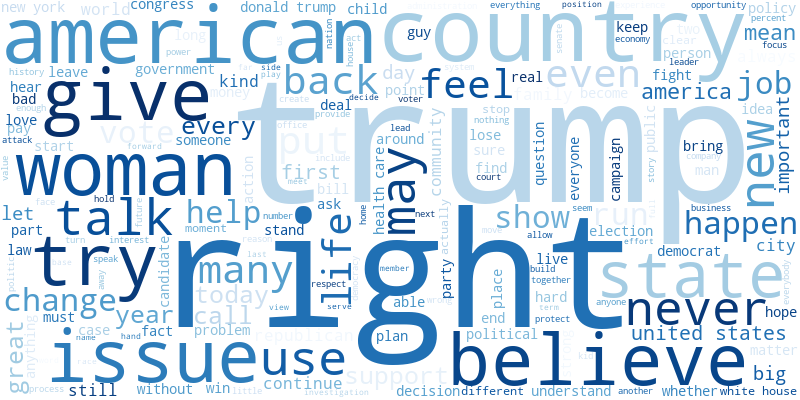
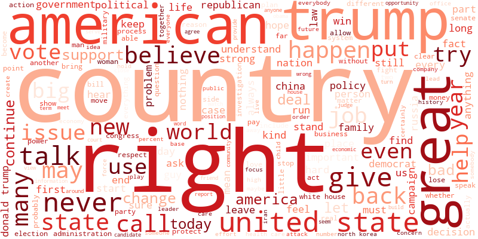
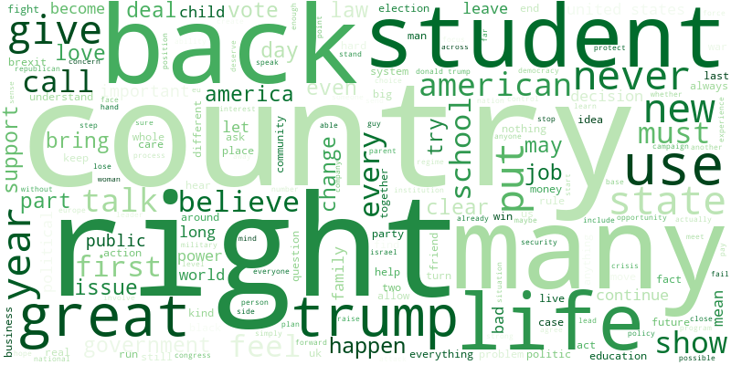
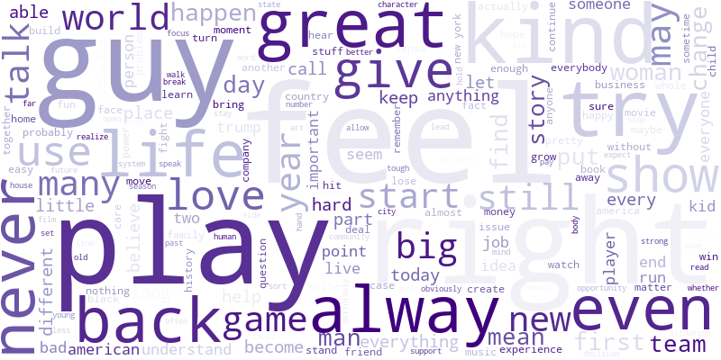

## Introduction

### Abstract

In the USA, the political orientation of American people is mostly divided into two main parties: the republicans and the democrats. The famous New York Times newspaper claims to be neutral, presenting both democratic and republican opinions. Here, we will use the quotebank dataset containing a set of quotations published in the newspapers between 2015 and 2020 to verify this statement. Using different techniques such as sentiment analysis and Principal Component Analysis, we will highlight the separation between pro-democratic and pro-republican in the quotations and their speakers and check whether one political orientation is more strongly represented than the other one. The determination of the political orientation will be based on sentiment analysis about several chosen topics that are commonly addressed in the USA and on which republicans and democrats tend to argue.

### Questions

This analysis answers the following questions:

<ul class="default">
    <li>Who are the main speakers quoted in the newspapers and from what political party are they?</li>
    <li>What is the opinion of newspapers on big subjects and debated topics? Are these opinions drifting towards one political party?</li>
</ul>

### Methods

**TODO** <!-- List the methods used -->

### Newspapers



---

## First analyses

### Who are the speakers?

**TODO** <!-- Counts of most frequent speakers in the different newspapers -->

<!-- Figure: Barplot for each newspaper -->


### Most frequent words

**TODO** <!-- Occurences of words (wordclouds) -->

<!-- Figure: Wordcloud for each newspaper -->

---

## Sentiment analysis
The Wordclouds may have been useful to visualize what the different political parties talk the most about, but what if we want to compare their opinions on the same subjects? Our idea was to use sentiment analysis to quantify the opinion of each party on specific topics. For both Democrat and Republican speakers, we collected the quotes talking about several specific topics:

<ul class="default">
    <li>immigration</li>
    <li>health care</li>
    <li>climate change</li>
    <li>Trump</li>
    <li>abortion</li>
    <li>women’s rights</li>
    <li>racisms</li>
    <li>violence</li>
    <li>war and military action</li>
    <li>taxes</li>
    <li>coal industry</li>
</ul>

For each of these topics, we computed the mean opinion score for each party. The scores range from **-1** (for a **negative** opinion) to **+1** (for a **positive** opinion).  
We then proceeded to do the same analysis separately with our 3 newspaper's quotes, to obtain mean opinion scores for all three of them. 

#### Topic detection

**TODO?** <!-- List topics, explain method -->  <!-- A QUEL POINT FAUT VRAIMENT EXPLIQUER LES METHODES DANS LA DATASTORY? -->



#### Sentiment analysis: comparison between political parties
<!-- Figure: Barplot average of compound score for each topic, each party -->


Clearly, the sentiment analysis results are not the ones expected. We should observe a clear demarcation between the opinion scores of Democrats and Republicans, at leat on topics such as immigration or health care, on which they are drastically opposed. But in our results there is little to no significant difference between both parties, meaning that **our sentiment analysis was unsuccessful**.

<!-- Table: topics with significant difference or not (?) -->

*Why was it the case?* 

We used a simple pretrained model for our sentiment analysis, based on emotions.  **TODO**
<!-- complete if we cannot improve the results -->

#### Sentiment analysis: comparison between the different journals

We can still visualize the sentiment analysis scores for the 3 newspaper, even if the results are not optimal.
**TODO** <!-- Sentiment analysis per topic for each newspaper -->

<!-- Figure: Barplot average of compound score for each topic, each newspaper -->

### What are the main topics in newspapers?

Instead of trying to determine what every actor *thinks* of a topic, we could simply quantify how much they *talk* about it. Indeed, the coverage of an event or a debated subject can also give us information about a newspaper's political opinion. The more a journal talks about a subjet, the more it cares about it. 

**TODO** <!-- Sentiment analysis per topic for each newspaper -->

<!-- Figure: Barplot frequency of quotes about each topic -->

### Political orientation of speakers and newspapers

**TODO** <!-- PCA with speakers, clustering if possible -->

<!-- Figure: Results of PCA with graph of speakers and newspapers -->

---

## Conclusion

**TODO**

---

## References

**TODO** <!-- Add references -->
